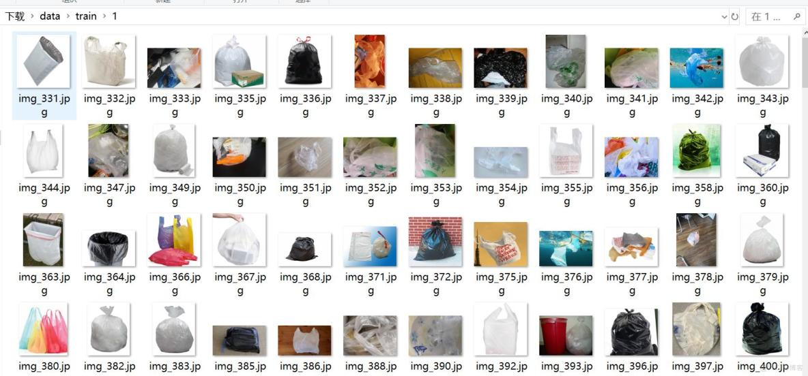
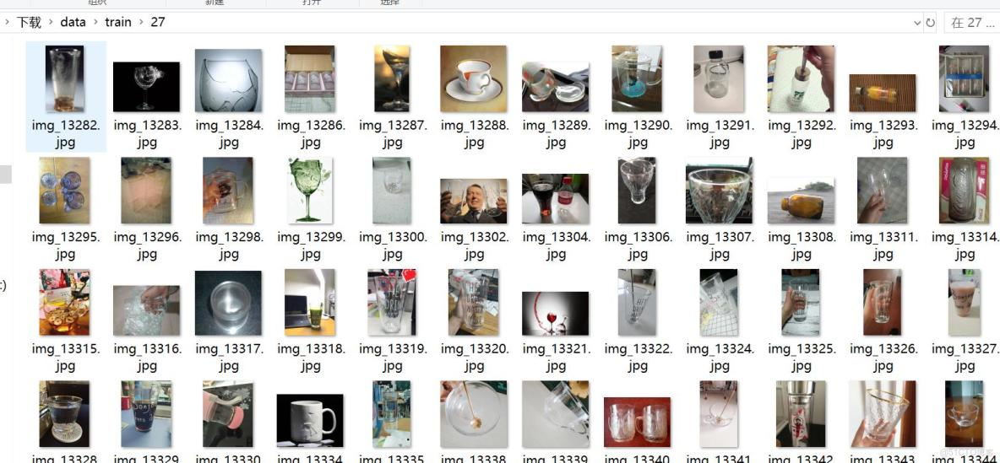

# Image Classification Dataset for Trash 14,402 Images in 40 Categories

The number of image files in each folder:
Path, number of photos
---------------------  
train\0  232  
train\1  360  
train\10  377  
train\11  726  
train\12  321  
train\13  399  
train\14  347  
train\15  409  
train\16  342  
train\17  299  
train\18  352  
train\19  302  
train\2  269  
train\20  216  
train\21  647  
train\22  365  
train\23  299  
train\24  308  
train\25  540  
train\26  341  
train\27  526  
train\28  372  
train\29  406  
train\3  75  
train\30  311  
train\31  436  
train\32  270  
train\33  312  
train\34  385  
train\35  341  
train\36  255  
train\37  312  
train\38  381  
train\39  427  
train\4  377  
train\5  279  
train\6  385  
train\7  352  
train\8  370  
train\9  379  
-------------------  
Total: 14,402
Folder Category:
{  
0: Other waste/Fast food box,
1: Other waste/damaged plastic,  
2: Other waste/tobacco ash,  
3: Other waste/toothpicks,  
4: Other waste/broken flowerpots and plates,  
5: Other waste/bamboo chopsticks,  
6: Kitchen waste/leftover food and vegetables,  
7: Kitchen waste/large bones,  
8: Kitchen waste/fruit peels,  
9: Kitchen waste/fruit flesh,  
10: Kitchen waste/tea leaves,  
11: Kitchen waste/leafy greens,  
12: Kitchen waste/eggshells,  
13: Kitchen waste/fish bones,  
14: Recyclables/power banks,  
15: Recyclables/bags,  
16: Recyclables/makeup bottles,  
17: Recyclables/plastic toys,  
18: Recyclables/plastic bowls and plates,  
19: Recyclables/plastic clothes hangers,  
20: Recyclables/express delivery bags,  
21: Recyclables/plugs and wires,  
22: Recyclables/old clothes,  
23: Recyclables/aluminum cans,  
24: Recyclables/pillows,  
25: Recyclables/plush toys,  
26: Recyclables/shampoo bottles,  
27: Recyclables/glass cups,  
28: Recyclables/leather shoes,  
29: Recyclables/boards,  
30: Recyclables/cardboard boxes,  
31: Recyclables/spices bottles,  
32: Recyclables/wine bottles,  
33: Recyclables/metal food cans,  
34: Recyclables/pans,  
35: Recyclables/oil barrels,  
36: Recyclables/bottles of drinks,  
37: Hazardous waste/disposable batteries,  
38: Hazardous waste/ointments,  
39: Hazardous waste/expired medicine.
}
## Image

Here is a pay link on Stripe ( https://buy.stripe.com/3cs8yP7sY87d0vu9AB ). Please contact me lonlonago@foxmail.com after funding $89, and I will send you a complete data files , thank you!

